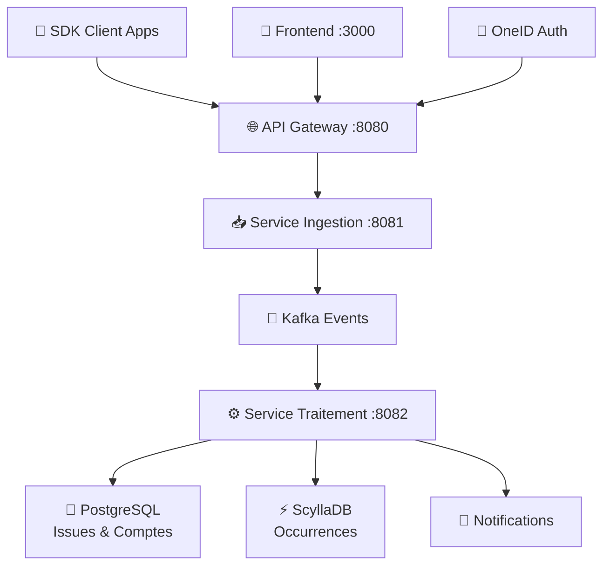

# 🐛 Bug Tracker – Event-Driven Microservices Platform

> **Plateforme SaaS inspirée de Sentry** pour détecter, agréger et résoudre les erreurs applicatives  
> Architecture micro-services pilotée par événements avec **Apache Kafka**

[](https://opensource.org/licenses/MIT)
[](https://www.docker.com/)
[](https://kafka.apache.org/)

---

## 📖 Table des matières

- [🏗️ Architecture](#️-architecture)
- [⚡ Démarrage rapide](#-démarrage-rapide)
- [📋 Prérequis](#-prérequis)
- [🗂️ Structure du projet](#️-structure-du-projet)
- [🔗 Endpoints disponibles](#-endpoints-disponibles)
- [⚙️ Configuration](#️-configuration)
- [🔄 Flux technique](#-flux-technique)
- [👨‍💻 Workflow développeur](#-workflow-développeur)
- [🗃️ Gestion & Maintenance](#️-gestion--maintenance)
- [🚀 Roadmap](#-roadmap)
- [📄 Licence](#-licence)

---

## 🏗️ Architecture

### Vue d'ensemble des services

| Service | Rôle | Technologie | Port interne | Port externe |
|---------|------|-------------|--------------|--------------|
| **🌐 Gateway** | Reverse-proxy & API Gateway | Nginx | 80 | **8080** |
| **📥 Service Ingestion** | Réception des erreurs → Kafka | Spring Boot | 8081 | **8081** |
| **⚙️ Service Traitement** | Traitement & persistance | Spring Boot | 8082 | **8082** |
| **🚀 Kafka** | Bus d'événements | Apache Kafka | 9092/19092 | **19092** |
| **🐘 Zookeeper** | Configuration Kafka | Apache Zookeeper | 2181 | 2181 |
| **🐘 PostgreSQL** | Base relationnelle | PostgreSQL 15 | 5432 | 5432 |
| **⚡ ScyllaDB** | Stockage massif NoSQL | ScyllaDB | 9042 | 9042 |
| **🔐 OneID** | OAuth 2.0 / OpenID Connect | Ory Hydra | 4444/4445 | 4444/4445 |
| **🎨 Frontend** | Interface utilisateur | React/Vue | 80 | **3000** |

### Schéma architectural



---

## ⚡ Démarrage rapide

### Installation en une commande

```bash
# Cloner le projet
git clone https://github.com/thyg/bugtracker-system.git
cd bugtracker-system

# Démarrer tous les services
docker compose up --build -d

# Vérifier le statut
docker compose ps --format "table {{.Name}}\t{{.State}}\t{{.Status}}"
```

### Tests de validation

```bash
# Test du gateway
curl http://localhost:8080/api/test
# Résultat attendu: "Traitement OK ✅"

# Test de santé des services
curl http://localhost:8081/actuator/health  # Service Ingestion
curl http://localhost:8082/actuator/health  # Service Traitement
```

### Accès aux interfaces

- **🌐 API Gateway** : http://localhost:8080
- **📊 Kafka UI** : http://localhost:19092 (si configuré)
- **🎨 Frontend** : http://localhost:3000
- **🔐 OneID Admin** : http://localhost:4445

---

## 📋 Prérequis

### Système requis

| Composant | Version minimale | Version recommandée |
|-----------|------------------|---------------------|
| **Docker Engine** | 20.10+ | **24.0+** |
| **Docker Compose** | v2.0+ | **v2.20+** |
| **Git** | 2.30+ | **2.40+** |
| **Mémoire RAM** | 4 GB | **8 GB** |
| **Espace disque** | 5 GB | **10 GB** |

> ⚠️ **Note** : Java et Maven ne sont pas requis sur l'hôte, tout s'exécute dans les conteneurs.

### Vérification de l'installation

```bash
# Vérifier Docker
docker --version && docker compose version

# Vérifier les ressources disponibles
docker system df
```

---

## 🗂️ Structure du projet
'''


bugtracker-system/
├── 📄 docker-compose.yml         # Orchestration des services
├── 📄 nginx.conf                 # Configuration du gateway
├── 📄 README.md                  # Documentation principale
├── 📄 .gitignore                 # Fichiers à ignorer par Git
├── 📁 .github/workflows/         # 🤖 CI/CD GitHub Actions
│   └── 📄 ci.yml
├── 📁 docs/                      # 📚 Documentation
│   └── 📄 README.md
├── 📁 frontend/                  # 🎨 Interface utilisateur (placeholder)
│   ├── 📁 dist/
│   └── 📄 README.md
├── 📁 sdk-java/                  # ☕ SDK Java pour clients
│   ├── 📁 src/
│   ├── 📁 target/
│   ├── 🐳 Dockerfile
│   ├── 📄 HELP.md
│   ├── 📁 mvnw & mvnw.cmd       # Maven Wrapper
│   └── 📄 pom.xml
├── 📁 service-ingestion/         # 📥 Micro-service d'ingestion
│   ├── 📁 src/
│   │   ├── 📁 main/java/com/bugtracker/service_ingestion/
│   │   │   └── 📄 ServiceIngestionApplication.java
│   │   └── 📁 resources/
│   │       ├── 📁 static/
│   │       ├── 📁 templates/
│   │       └── 📄 application.properties
│   ├── 📁 test/
│   ├── 📁 target/
│   ├── 🐳 Dockerfile
│   ├── 📄 HELP.md
│   ├── 📁 mvnw & mvnw.cmd       # Maven Wrapper
│   ├── 📄 pom.xml
│   └── 📄 README.md
└── 📁 service-traitement/        # ⚙️ Micro-service de traitement
    ├── 📁 src/
    │   ├── 📁 main/java/com/bugtracker/service_traitement/
    │   │   ├── 📁 controller/
    │   │   │   ├── 📄 TestController.java
    │   │   │   └── 📄 ServiceTraitementApplication.java
    │   │   └── 📄 ServiceTraitementApplication.java
    │   └── 📁 resources/
    │       ├── 📁 static/
    │       ├── 📁 templates/
    │       └── 📄 application.properties
    ├── 📁 test/
    ├── 📁 target/
    ├── 🐳 Dockerfile
    ├── 📄 HELP.md
    ├── 📁 mvnw & mvnw.cmd          # Maven Wrapper
    ├── 📄 pom.xml
    └── 📄 README.md```

```

---

## 🔗 Endpoints disponibles

### API Principales

| Méthode | Endpoint | Service | Description |
|---------|----------|---------|-------------|
| `POST` | `/api/errors` | Ingestion | 📥 Réception des erreurs depuis les SDK |
| `GET` | `/api/issues` | Traitement | 📋 Liste des issues agrégées |
| `GET` | `/api/issues/{id}` | Traitement | 🔍 Détail d'une issue |
| `POST` | `/api/issues/{id}/resolve` | Traitement | ✅ Marquer comme résolue |

### Endpoints de monitoring

| Méthode | Endpoint | Description |
|---------|----------|-------------|
| `GET` | `/api/test` | 🏥 Test de connectivité |
| `GET` | `/actuator/health` | 💚 Health check Spring Boot |
| `GET` | `/actuator/metrics` | 📊 Métriques de performance |

### Exemple d'utilisation

```bash
# Envoyer une erreur
curl -X POST http://localhost:8080/api/errors \
  -H "Content-Type: application/json" \
  -d '{
    "message": "NullPointerException in UserService",
    "stackTrace": "java.lang.NullPointerException: Cannot invoke...",
    "level": "ERROR",
    "timestamp": "2025-06-03T10:30:00Z",
    "tags": {
      "environment": "production",
      "service": "user-service"
    }
  }'

# Récupérer les issues
curl http://localhost:8080/api/issues
```

---

## ⚙️ Configuration

### Variables d'environnement principales

Copiez `.env.example` vers `.env` et adaptez selon vos besoins :

```bash
# Base de données PostgreSQL
POSTGRES_USER=bugtracker
POSTGRES_PASSWORD=bug123
POSTGRES_DB=bugdb

# Kafka Configuration
KAFKA_ADVERTISED_LISTENERS=PLAINTEXT://localhost:9092
KAFKA_AUTO_CREATE_TOPICS=true

# OneID OAuth Configuration
HYDRA_ADMIN_URL=http://localhost:4445
HYDRA_PUBLIC_URL=http://localhost:4444

# Services Configuration
INGESTION_SERVICE_URL=http://service-ingestion:8081
TRAITEMENT_SERVICE_URL=http://service-traitement:8082
```

### Configuration avancée

#### Kafka Topics personnalisés

```yaml
# Dans docker-compose.yml
environment:
  KAFKA_CREATE_TOPICS: >
    events:3:1,
    alerts:1:1,
    notifications:1:1
```

#### Scaling des services

```bash
# Scaler le service de traitement
docker compose up -d --scale service-traitement=3
```

---

## 🔄 Flux technique

### Architecture événementielle

```
┌─────────────────┐    POST /api/errors    ┌─────────────────────┐
│  📱 SDK Client  │ ──────────────────────► │ 📥 Service          │
│  Applications   │                         │   Ingestion         │
└─────────────────┘                         └──────────┬──────────┘
                                                       │
                                            Kafka      │
                                            Events     │
                                                       ▼
┌─────────────────┐    REST API Queries    ┌─────────────────────┐
│  🎨 Frontend    │ ◄─────────────────────  │ ⚙️ Service          │
│  Dashboard      │                         │   Traitement        │
└─────────────────┘                         └──────────┬──────────┘
                                                       │
                                            Persistence │
                                                       ▼
                                         ┌──────────────────────┐
                                         │ 🐘 PostgreSQL        │
                                         │ (Issues & Metadata)  │
                                         └──────────────────────┘
                                         ┌──────────────────────┐
                                         │ ⚡ ScyllaDB          │
                                         │ (Raw Occurrences)    │
                                         └──────────────────────┘
```

### Traitement des événements

1. **📥 Ingestion** : Réception et validation des erreurs
2. **🚀 Publication** : Envoi vers Kafka topic `events`
3. **⚙️ Consommation** : Traitement asynchrone par le service de traitement
4. **🔄 Déduplication** : Regroupement des erreurs similaires
5. **💾 Persistance** : Stockage dans PostgreSQL (metadata) et ScyllaDB (détails)
6. **🔔 Notification** : Alertes pour les nouvelles issues critiques

---

## 👨‍💻 Workflow développeur

### Développement local

```bash
# 1. Modifier le code dans le service ciblé
cd service-ingestion/

# 2. Rebuild spécifique (plus rapide)
docker compose build service-ingestion

# 3. Redémarrer uniquement ce service
docker compose up -d service-ingestion

# 4. Vérifier les logs
docker compose logs -f service-ingestion
```

### Tests et debugging

```bash
# Logs en temps réel
docker compose logs -f

# Accès à un conteneur pour debugging
docker compose exec service-traitement bash

# Restart complet en cas de problème
docker compose restart
```

### Ajout d'un nouveau service

1. **Créer le dossier** : `mkdir service-notification/`
2. **Ajouter le Dockerfile** et le code source
3. **Déclarer dans docker-compose.yml** :

```yaml
service-notification:
  build: ./service-notification
  ports:
    - "8083:8083"
  environment:
    - KAFKA_BOOTSTRAP_SERVERS=kafka:9092
  depends_on:
    - kafka
```

4. **Mapper les ports** si accès externe nécessaire
5. **Tester** : `docker compose up -d service-notification`

### CI/CD avec GitHub Actions

Le workflow `.github/workflows/ci.yml` automatise :
- ✅ **Build** de tous les services
- 🧪 **Tests unitaires** et d'intégration  
- 🐳 **Publication** des images Docker
- 🚀 **Déploiement** automatique

---

## 🗃️ Gestion & Maintenance

### Commandes utiles

```bash
# État des services
docker compose ps

# Utilisation des ressources
docker stats

# Nettoyage complet
docker compose down -v --remove-orphans
docker system prune -af

# Backup des données
docker exec postgres pg_dump -U bugtracker bugtracker_db > backup.sql

# Monitoring des logs Kafka
docker compose exec kafka kafka-console-consumer.sh \
  --bootstrap-server localhost:9092 \
  --topic events --from-beginning
```

### Surveillance et métriques

- **📊 Métriques** : Intégration Prometheus/Grafana prévue
- **🏥 Health Checks** : Endpoints `/actuator/health` sur chaque service
- **📝 Logs centralisés** : ELK Stack en roadmap
- **🔔 Alerting** : Slack/Email pour les erreurs critiques

### Sauvegarde et restauration

```bash
# Sauvegarde PostgreSQL
docker compose exec -T postgres pg_dump -U $POSTGRES_USER $POSTGRES_DB > backup_$(date +%Y%m%d).sql

# Restauration
docker compose exec -T postgres psql -U $POSTGRES_USER $POSTGRES_DB < backup_20250603.sql
```

---

## 🚀 Roadmap

### Phase 1 : Core Platform ✅
- [x] Architecture micro-services avec Kafka
- [x] Service d'ingestion des erreurs
- [x] Service de traitement et déduplication
- [x] Persistance PostgreSQL + ScyllaDB

### Phase 2 : Fonctionnalités avancées 🚧
- [ ] **Service de notification** (Slack, Email, Webhooks)
- [ ] **SDK multi-langage** (Java, JavaScript, Python, Go)
- [ ] **API REST complète** (CRUD issues, filtering, search)
- [ ] **Authentification OAuth 2.0** avec OneID

### Phase 3 : Interface utilisateur 📋
- [ ] **Dashboard React** avec Tailwind CSS
- [ ] **Real-time updates** via WebSockets
- [ ] **Graphiques et analytics** (Chart.js/D3.js)
- [ ] **Gestion des équipes** et permissions

### Phase 4 : Productionisation 🏗️
- [ ] **Tests d'intégration** et E2E (Cypress)
- [ ] **Monitoring avancé** (Prometheus + Grafana)
- [ ] **Déploiement Kubernetes** (Helm charts)
- [ ] **CI/CD complet** avec staging/production

### Phase 5 : Scalabilité 🚀
- [ ] **Load balancing** intelligent
- [ ] **Horizontal scaling** automatique
- [ ] **Multi-tenancy** pour SaaS
- [ ] **Analytics avancées** et ML pour la détection d'anomalies

---

## 🤝 Contribution

### Comment contribuer

1. **🍴 Fork** le projet
2. **🌿 Créer** une branche feature (`git checkout -b feature/nouvelle-fonctionnalite`)
3. **💻 Commiter** vos changements (`git commit -am 'Ajouter nouvelle fonctionnalité'`)
4. **🚀 Pusher** la branche (`git push origin feature/nouvelle-fonctionnalite`)
5. **📝 Créer** une Pull Request

### Standards de code

- **Java** : Google Java Style Guide
- **Frontend** : ESLint + Prettier
- **Docker** : Multi-stage builds optimisés
- **Git** : Conventional Commits

---

## 📄 Licence

```
MIT License

Copyright (c) 2025 Équipe Bug Tracker

Permission is hereby granted, free of charge, to any person obtaining a copy
of this software and associated documentation files (the "Software"), to deal
in the Software without restriction, including without limitation the rights
to use, copy, modify, merge, publish, distribute, sublicense, and/or sell
copies of the Software, and to permit persons to whom the Software is
furnished to do so, subject to the following conditions:

The above copyright notice and this permission notice shall be included in all
copies or substantial portions of the Software.

THE SOFTWARE IS PROVIDED "AS IS", WITHOUT WARRANTY OF ANY KIND, EXPRESS OR
IMPLIED, INCLUDING BUT NOT LIMITED TO THE WARRANTIES OF MERCHANTABILITY,
FITNESS FOR A PARTICULAR PURPOSE AND NONINFRINGEMENT. IN NO EVENT SHALL THE
AUTHORS OR COPYRIGHT HOLDERS BE LIABLE FOR ANY CLAIM, DAMAGES OR OTHER
LIABILITY, WHETHER IN AN ACTION OF CONTRACT, TORT OR OTHERWISE, ARISING FROM,
OUT OF OR IN CONNECTION WITH THE SOFTWARE OR THE USE OR OTHER DEALINGS IN THE
SOFTWARE.
```

---

## 📞 Support

- **📧 Email** : yimbouthedom@gmail.com
- **💬 Discord** : [Serveur communautaire](https://discord.gg/bugtracker)
- **📖 Documentation** : [docs.bugtracker.dev](https://docs.bugtracker.dev)
- **🐛 Issues** : [GitHub Issues](https://github.com/thyg/bugtracker-system/issues)

---

<div align="center">

**🚀 Happy Hacking !**

*Développé avec ❤️ par l'équipe Bug Tracker*

[](https://www.docker.com/)
[](https://kafka.apache.org/)
[](https://spring.io/projects/spring-boot)

</div>